# Projekt 1 - klasyczny pick&place
## Wstęp
  Celem pierwszego projektu była implementacja prostego algorytmu umożliwiającemu (symulowanemu) robotowi Velma przeniesienie pewnego obiektu z jednego na drugi stół znajdującego się przed nią. Okazuje się, że zadanie które jest banalne dla człowieka sprawia wiele trudności robotowi. Dwoma głównymi zadaniami stojącymi przed robotem jest wyliczenie odpowiednich kątów w stawach umożliwiających znalezienie się efektora w odpowiedniej pozycji (jest to zadanie odwrotnej kinematyki), między innymi, do chwycenia i odłożenia obiektu oraz wyznaczenie odpowiedniej trajektorii zmian kątów w stawach która pozwoli mu na ominięcie przeszkód podczas ruchu do obiektu ( w tym celu wykorzystywana jest planer posiadający octomapę środowskia, która została wcześniej stworzona). Implementacja naszego algorytmu skupiała się przede wszysktim na rozwiązaniu tych dwóch problemów, i odpowiedniej sekwencji ich wykonania.

 Zadanie przemieszczenia się manipulatora do odpowiedniej pozycji względem obiektu wykorzystuje 2 tryby ruchu:
- JIMP - jest to ruch w przestrzeni stawów, polegający na zadaniu odpowiedniej trajektori kątów w stawach. Wykorzystujemy go do bardziej skąplikowanych ruchów, gdzie konieczne jest uwzględnianie przeszkód.
- CIMP - jest to ruch w przestrzeni kartezjańskiej, polegający na zadaniu pozycji i orientacji względem pewnego układu odniesienia. Wykorzystujemy go do zbliżenia/ oddalenia się od obiektu po wcześniejszym ruchu typu JIMP. 
<br>

Na potrzeby eksperymentów stworzyliśmy kilka światów: <em>world_nowy_1.world</em> ,<em>world_nowy_2.world</em>, <em>world_nowy_3.world</em> znajdujące się w folderze /data/gazebo/worlds. Wybór świata dokonywany jest w pliku pick_place.lauch, którego uruchomienie jest niezbędne do działania cełego środowiska.<br>

 
 ## Uruchomienie środowiska:
 w celu uruchomienia stworzonego przez nas programu potrzebne są 3 terminale:
 - W pierwszym uruchamiamy plik <em>pick_place.launch</em> z pakietu <em>stero_manipulation</em> komendą:
  ```
    roslaunch stero_manipulation pick_place.launch
  ```
 - W drugim uruchamiamy program gazebo komendą:
  ```
    roslaunch rcprg_gazebo_utils gazebo_client.launch
  ```
 - W trzecim uruchamiamy stworzony przez nas plik <em>pick_place.py</em> z pakietu <em>stero_manipulation</em> komendą:
  ```
    rosrun stero_manipulation pick_place.py
  ```
 
 ## Implementacja:
 Całość implementacja znajduje się w pliku <em>pick_place.py</em>. Kod został podzielony na funkcje:
 - <em>init()</em>: odpowiada za wstępną inicjalizację velmy, włączenie silników, homing, wczytanie octomapy, stworzenie obiektu planera.
 - <em>gripper_change()</em>: funkcja wykonująca otworzenie lub zamknięcie chwytaka, w zalezności od ich stanu, w podanej "ręce".
 - <em>calculate_goal_position()</em>: funkcja zwracająca położenie punktu nad obiektem względem układu świata.
 - <em>calculate_table_position()</em>: funkcja zwracająca pożożenie stołu na któy ma zostać odłożony obiekt w układzie świata.
 - <em>is_object_on_right_table()</em>: funkcja zwracająca wartość logiczną, mówiącą o tym na którym stole znajduje się obiekt.
 - <em>calculate_IK()</em>: funkcja wyliczające kinematykę odwrotną.
 - <em>get_object_in_hand()</em>: funkcja zwracająca obiekt, który następnie jest uwzględniany przy planowanniu ruchu z obiektem w chwytaku, aby nie doszł do kolizji między przenoszonym obiektem, a światem.
 - <em>make_and_execute_plan()</em>: funkcja odpowiedzalna za wyznaczenie oraz wykonanie trajektorii w trybie JIMP na podstawie rozwiązania odwrotnej kinematyki.
 - <em>move_cart()</em>: funkcja odpowiedzalna za wykonanie ruchu w przestrzeni kartezjańskiej ( zbliżenie i oddalenie się względem obiektu)
 - <em>go_to_starting_positon()</em>: funkcja wykonująca powrót do pozycji początkowej po zakonczonym zadaniu przeniesiania objektu (kożysta z planrea w celu uniknięcia kolizji z otoczeniam).
 - <em>main()</em>: zawiera wywołania wyżej wymienionych funkcji w takiej kolejności aby wykonanie zadania było możliwe. 
 
 
 ## Wizualizacja poszczególnych etapów działania systemu:
 1. Stworzona octomapa dla zadania pick&place:
 <div align="center">
    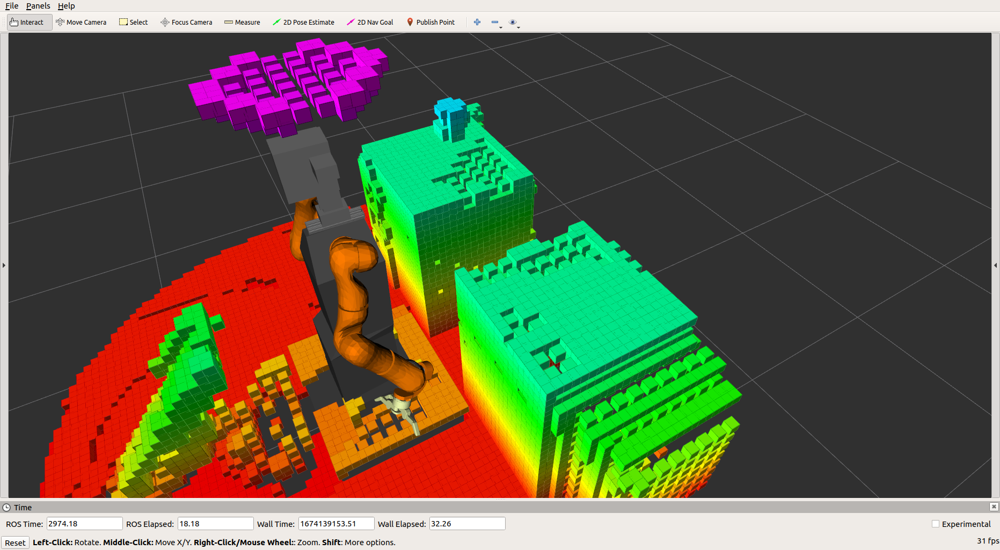
 </div>
 
 2. Konfiguracja początkowa świata:
  <div align="center">
    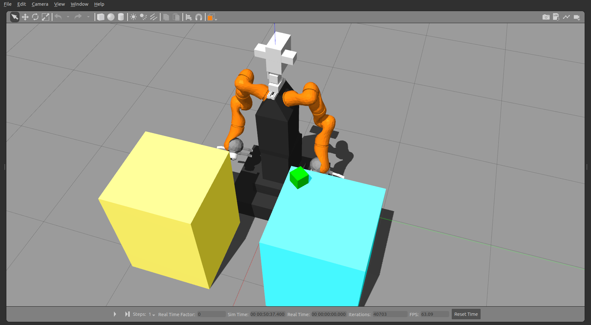
 </div>
 
 3. Ustawienie manipulatora nad obiektem:
 <div align="center">
    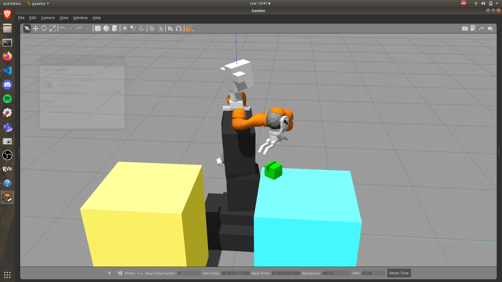
 </div>
 
 4. Opuszczenie manipulatora nad obiekt i chwycenie go:
  <div align="center">
    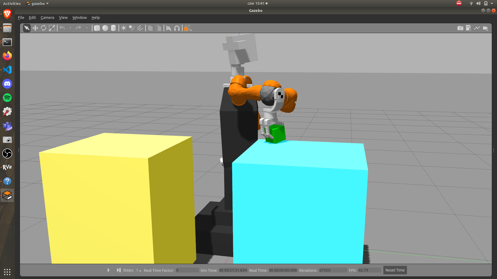
 </div>
 
 5. Niewielkie uniesienie obiektu:
 <div align="center">
    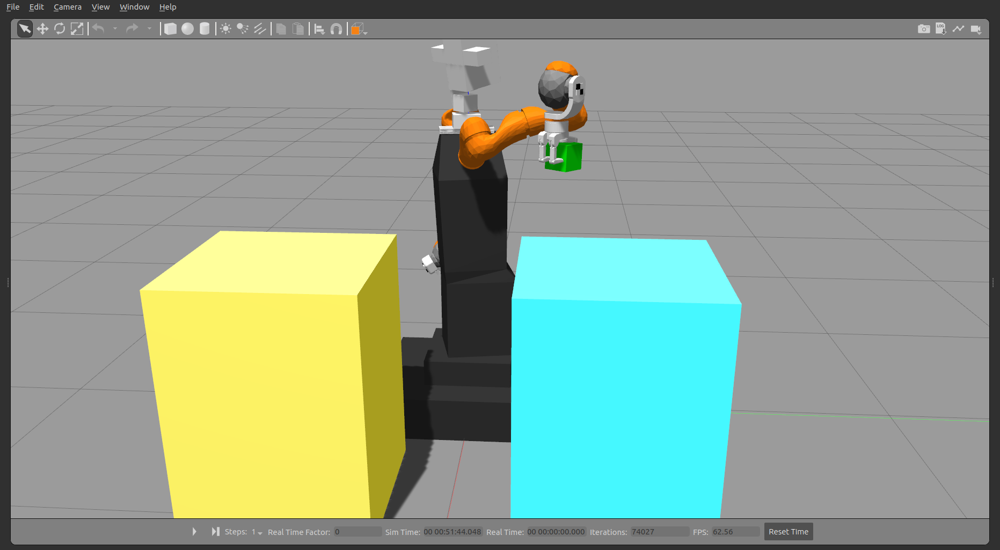
 </div>
 
 6. Przeniesienie obiektu nad 2-gi stolik:
  <div align="center">
    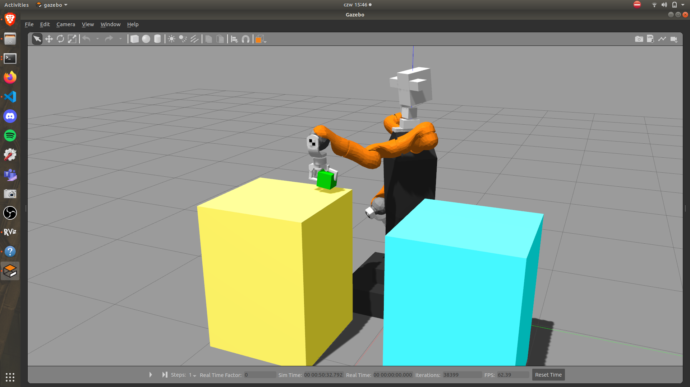
 </div>
 
 7. Opuszczenie obiektu na 2-gi stolik i otworzenie grippera:
 <div align="center">
    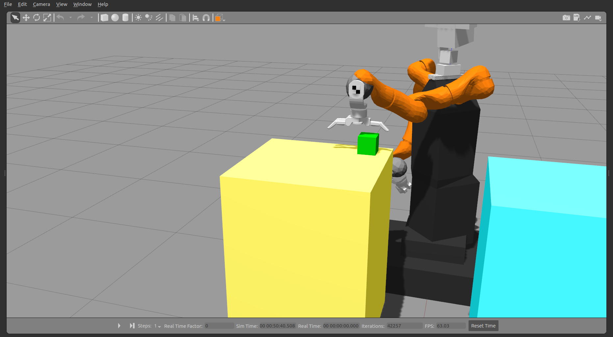
 </div>
 
 8. Powrót do pozycji początkowej
 <div align="center">
    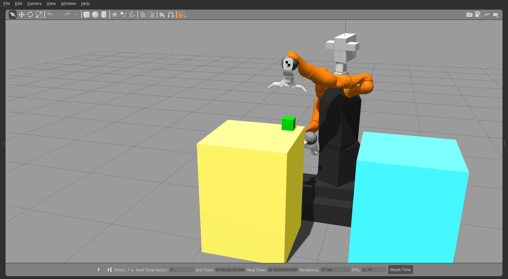
 </div>
<br>
<br>
<br>

# Projekt 2 - otworzenie szafki

## Wstęp  
Celem drugiego projektu była implementacja systemu umożliwiającemu (symulowanemu) robotowi Velma otworzenie drzwiczek szafki o kąt >= 90 stopni. Ponownie przekonaliśmy się o tym, że zadanie które jest banalne dla człowieka może sprawić wiele trudności robotowi. Najważniejsze zadania stojące przed robotem czyli zadanie odwrotnej kinematyki, wyznaczenie odpowiedniej trajektorii zmian kątów w stawach która pozwoli mu na ominięcie przeszkód podczas ruchu do obiektu pozostaja takie same jak w Projekcie 1. Dodatkowym utrudnieniem jest konieczność delikatnego sterowania manipulatorem robota aby środowisko nie uległo uszkodzeniu (np. nie została wyrwana klamka drzwiczek).
  
Główną różnicą względem zadania pick&place była więc konieczność zastosowania sterowania impedancyjengo w przestrzeni kartezjańskiej w celu wykrycia kontaktu z szafką i "delikatnego" obchodzenia się z nią. 

 Zadanie przemieszczenia się manipulatora do odpowiedniej pozycji względem szafki i jej drzwiczek wykorzystuje 2 tryby ruchu:
- JIMP - jest to ruch w przestrzeni stawów, polegający na zadaniu odpowiedniej trajektori kątów w stawach. Wykorzystujemy go do bardziej skąplikowanych ruchów, gdzie konieczne jest uwzględnianie przeszkód.
- Imp_CIMP - jest to ruch w przestrzeni kartezjańskiej, polegający na zadaniu pozycji i orientacji względem pewnego układu odniesienia. Dodatkowo definiujemy sztywność manipulatora (dokładniej to jej trajektorię) w 3 osiach (sztywność określa jak bardzo ramię jest podatne na przemieszczenie w danej osi na skutek działania zewnętrznych sił), a także tolerancję osiągnięcia zadanej pozycji. Wykorzystujemy go do delikatnego otworzenia drzwiczek.

<br>
 
 ## Uruchomienie środowiska:
 w celu uruchomienia stworzonego przez nas programu potrzebne są 3 terminale:
 - W pierwszym uruchamiamy plik <em>open_cabinet.launch</em> z pakietu <em>stero_manipulation</em> komendą:
  ```
    roslaunch stero_manipulation open_cabinet.launch
  ```
 - W drugim uruchamiamy program gazebo komendą:
  ```
    roslaunch rcprg_gazebo_utils gazebo_client.launch
  ```
 - W trzecim uruchamiamy stworzony przez nas plik <em>open_cabinet.py</em> z pakietu <em>stero_manipulation</em> komendą:
  ```
    rosrun stero_manipulation open_cabinet.py
  ```
 
 ## Implementacja:
 Całość implementacja znajduje się w pliku <em>open_cabinet.py</em>. Kod został podzielony na funkcje:
 - <em>init()</em>: odpowiada za wstępną inicjalizację velmy, włączenie silników, homing, wczytanie octomapy, stworzenie obiektu planera.
 - <em>gripper_change()</em>: funkcja ustawiająca chwytak w odpowiednij konfiguracji w zalezności od jego stanu.
 - <em>calculate_goal_position()</em>: funkcja zwracająca położenie klamki względem układu świata.
 - <em>calculate_cabinet_position()</em>: funkcja zwracająca położenie szafki względem układu świata.
 - <em>calculate_IK()</em>: funkcja wyliczające kinematykę odwrotną.
 - <em>make_and_execute_plan()</em>: funkcja odpowiedzalna za wyznaczenie oraz wykonanie trajektorii w trybie JIMP na podstawie rozwiązania odwrotnej kinematyki.
 - <em>makeWrench()</em>: funkcja zwracająca obiekt typu PyKDL.Wrench niezbędny w celu zdefiniowania sztywności ramienia.
 - <em>makePathTol()</em>: funkcja zwracająca obiekt typu PyKDL.Twist niezbędny w celu zdefiniowania tolerancji osiągnięcia zadanego położenia manipulatora.
 - <em>switch_to_cart_imp()</em> - funkcja przełączająca tryb ruchu.
 - <em>move_cart()</em>: funkcja odpowiedzalna za wykonanie ruchu w przestrzeni kartezjańskiej z uwzględnieniem zadanej sztywnoiści i tolerancji.
 - <em>open_cabinet()</em>: funkcja zadająca kolejne pozycje końcówki manipulatora w przestrzeni kartezjańskiej, tak aby velma otworzyła drzwiczki.
 - <em>go_to_starting_positon()</em>: funkcja wykonująca powrót do pozycji początkowej po zakonczonym zadaniu przeniesiania objektu (kożysta z planrea w celu uniknięcia kolizji z otoczeniam).
 - <em>main()</em>: zawiera wywołania wyżej wymienionych funkcji w takiej kolejności aby wykonanie zadania było możliwe. 
 
 ## Wizualizacja poszczególnych etapów działania systemu:
 1. Stworzona octomapa dla zadania otworzenia szafki:
  <div align="center">
    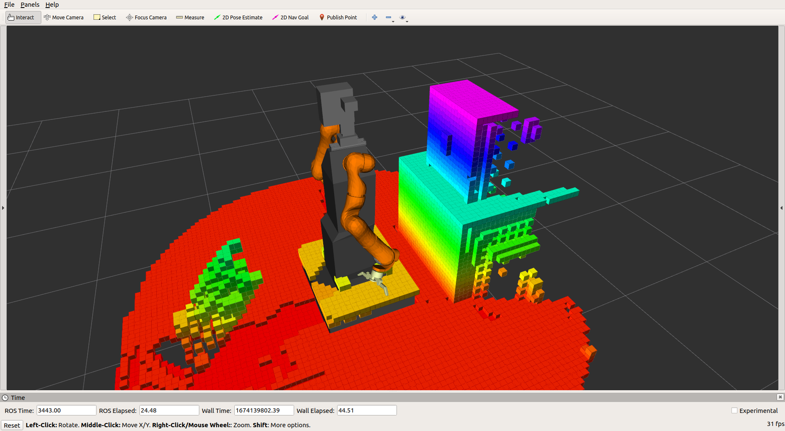
 </div>
 
 2. Przemieszczenie manipulatora przed klamkę:
 <div align="center">
    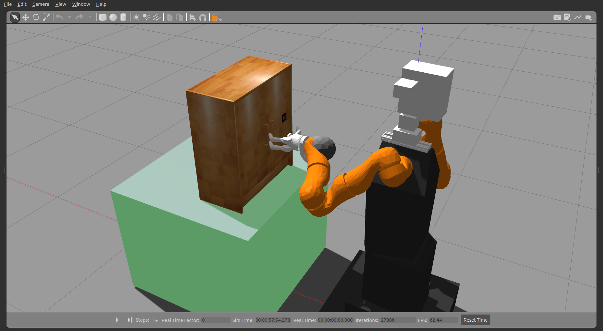
 </div>
 
 3. Chwycenie klamki:
 <div align="center">
    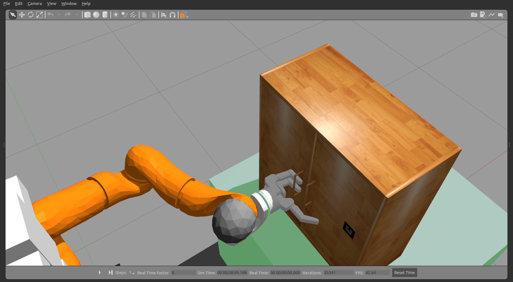
 </div>
 
 4. Częściowe otworzenie drzwiczek i puszczenie klamki:
 <div align="center">
    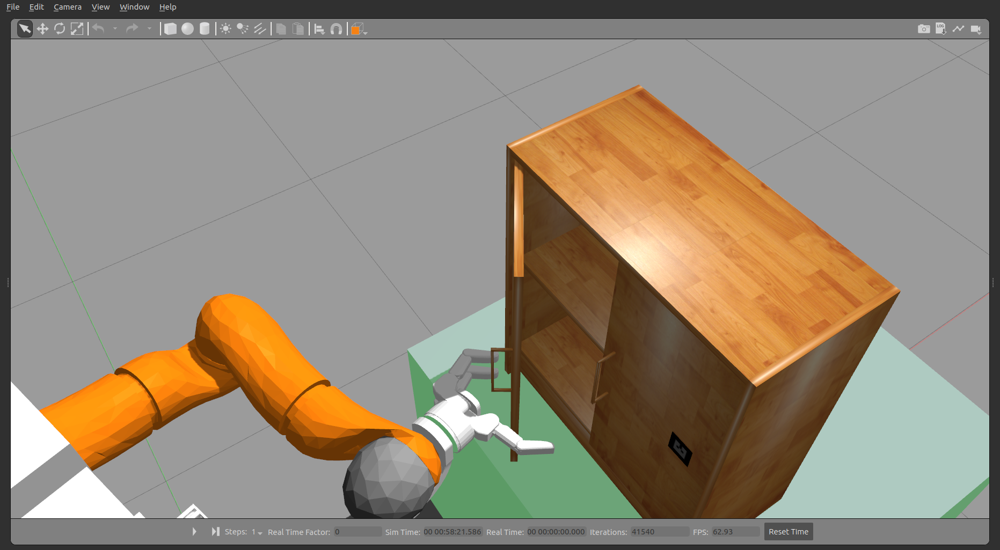
 </div>
 
 5. "Odsunięcie się" od drzwiczek oraz zamiana konfiguracji grippera:
 <div align="center">
    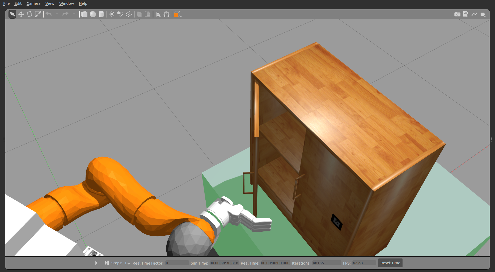
 </div>
 
 6. Ustawienie manipulatora w taki sposób aby pozostałą część otorzenia drzwiczek można było wykonać pchając je:
  <div align="center">
    
 </div>
 
 7. Pchnięcie drzwiczek i tym samy osiągnięce celu zadania - drzwiczki otwarte >= 90 stopni:
 <div align="center">
    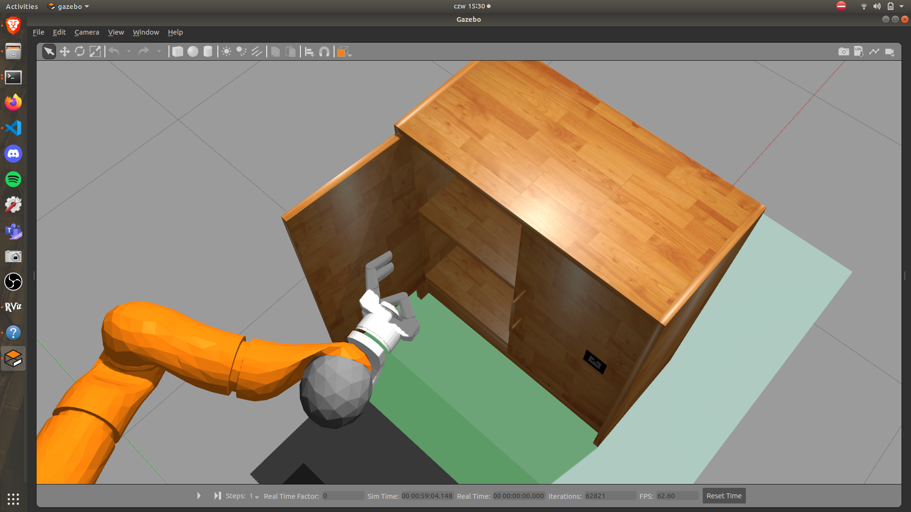
 </div>
 
 8. Powrót do pozycji początkowej 
 <div align="center">
    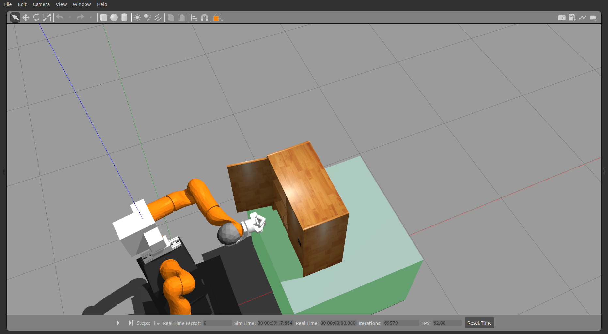
 </div>
 
 ## Diagramy:
 <div align="center">
    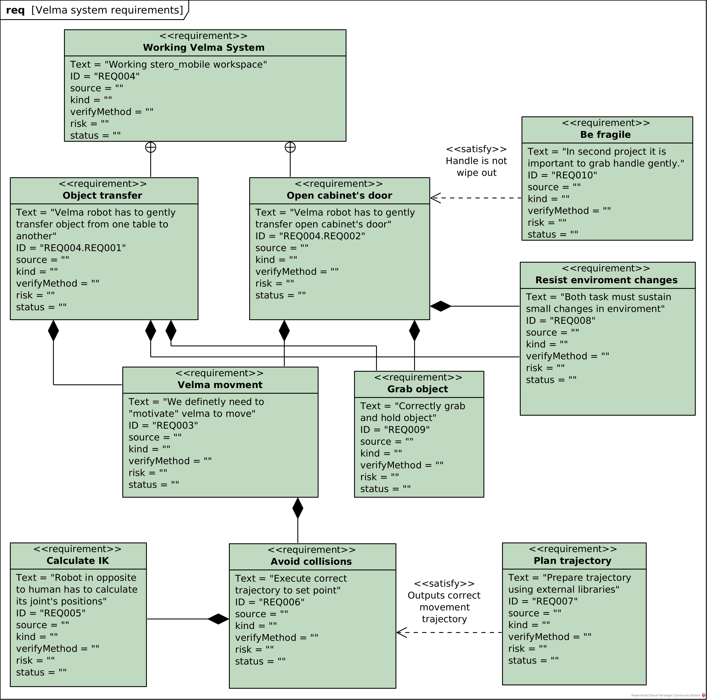
 </div>


 <p float="center">
 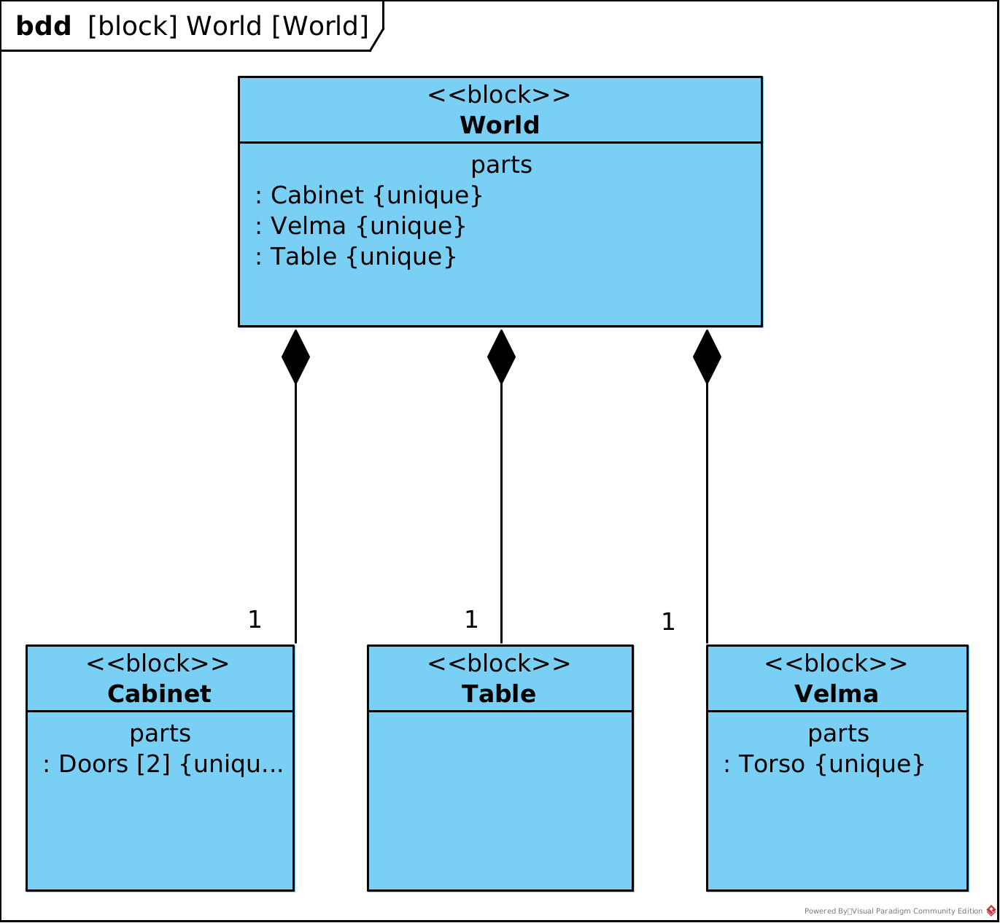  
 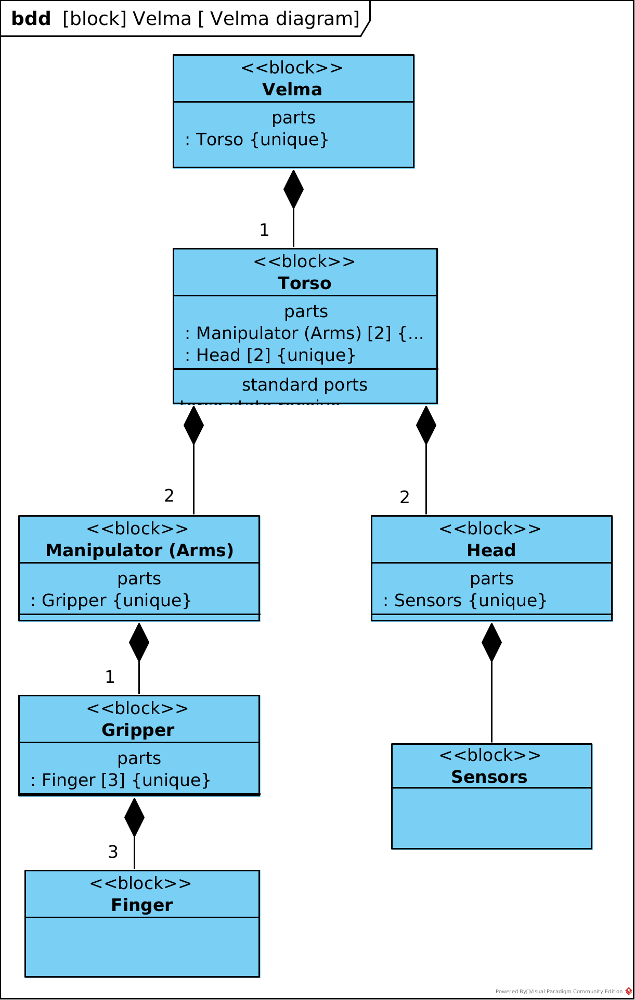
 
 </p>
 

 <div align="center">
    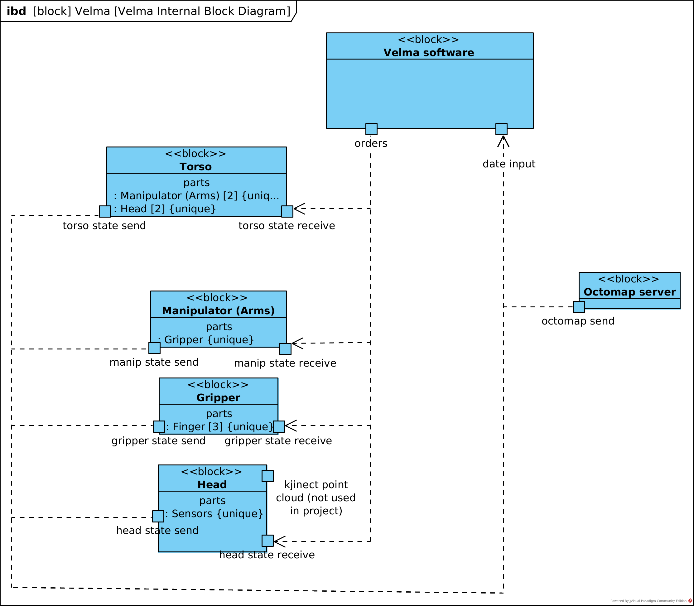
 </div>
 <br>
 
 
 <div align="center">
    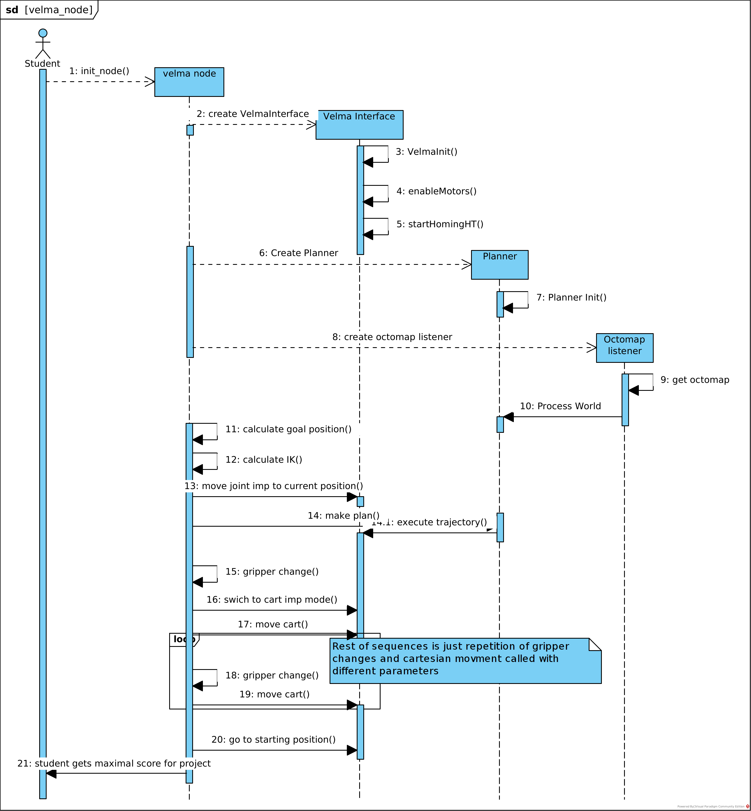
 </div>
 
  <div align="center">
 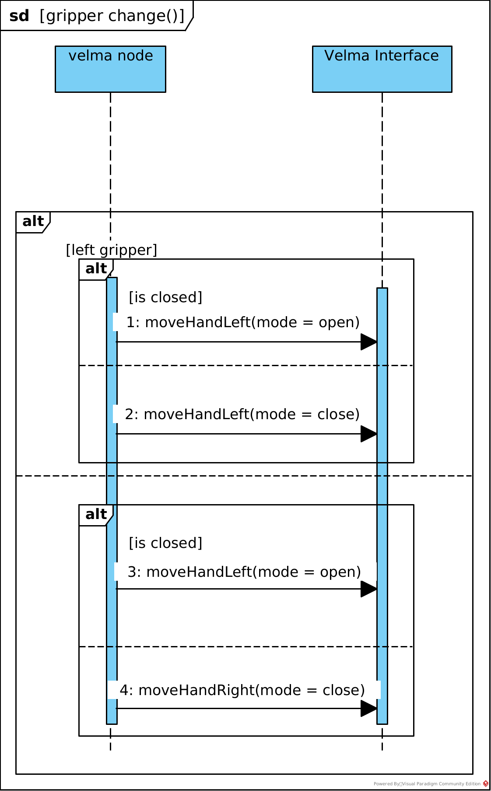  
 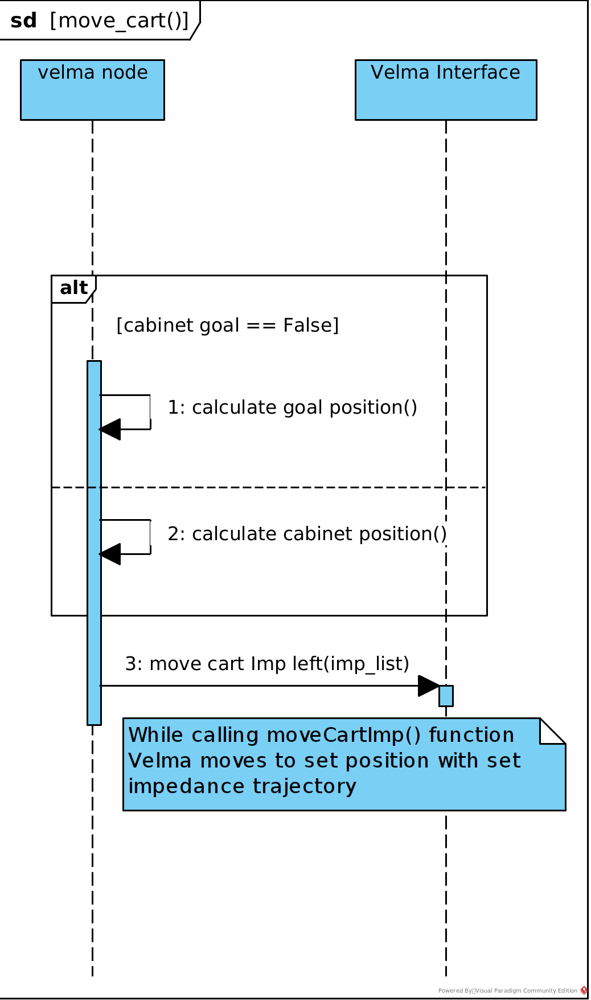
 </div>
 
 <div align="center">
    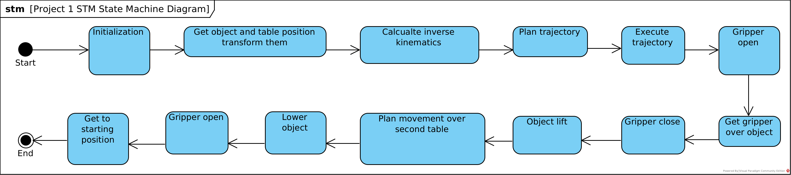
 </div>
 
 <div align="center">
    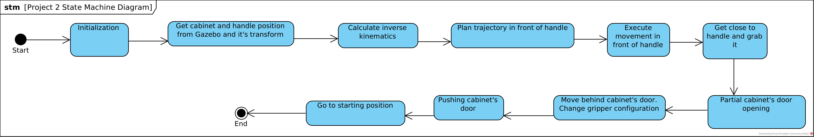
 </div>


